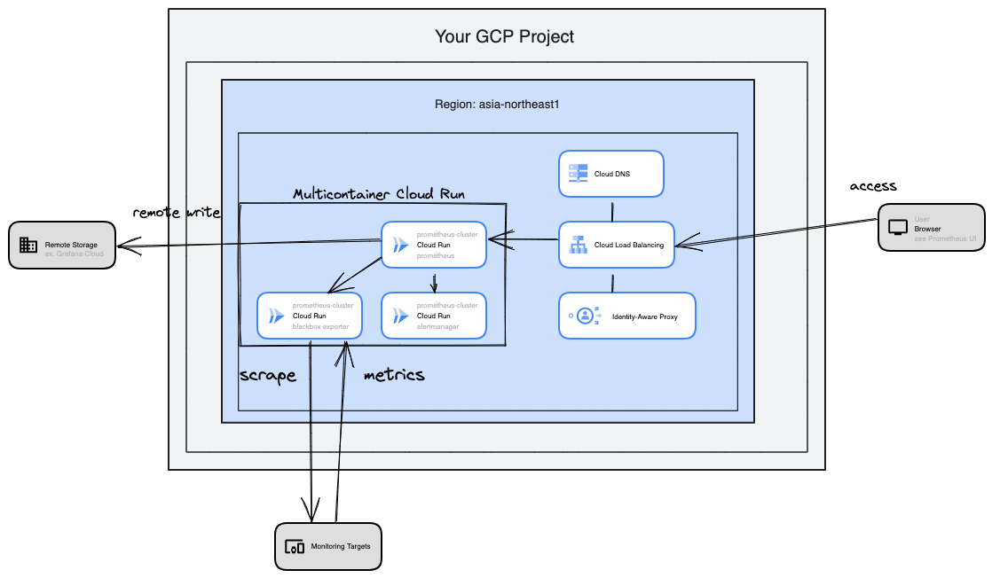

# cloudrun-prometheus-boilerplate
An example  to manage container applications using multicontainer Cloud Run.

This is Cloud Run vesion of [fargate-prometheus-boilerplate](https://github.com/umatare5/fargate-prometheus-boilerplate.git).

## Background

Multicontainer Cloud Run is useful to build and deploy a small-scale web system quickly.
In this repository, we build a external monitoring system using Prometheus as an example.

## Architecture

### Overview



### Description

- This repository is used for deploying prometheus-cluster service on `multicontainer Cloud Run`.
- The cluster contains Prometheus and Blackbox Exporter.
- Prometheus is the ingress container, and other services are sidecars.
- Prometheus is supposed to use remote write function (If you don't need it, remove them from prometheus.yml.template).
- Container images are built on `Cloud Build` , and stored in `Artifact Registry`.

## Getting Started

Containers activated by `docker compose up` are defined in `services/prometheus/.local`.
On the other hand, containers deployed to Google Cloud are defined in `services/prometheus`. Be careful!

### Run Locally

1. Set environment variables to specify remote write (If you don't need remote write, remove remote write section from prometheus.yml).

    ```bash
    export REMOTE_WRITE_URL=<YOUR REMOTE WRITE URL>
    export REMOTE_USERNAME=<YOUR REMOTE WRITE USERNAME>
    export REMOTE_PASSWORD=<YOUR REMOTE PASSWORD>
    ```

2. Run containers locally.
    ```bash
    docker compose up
    ```
    Or Use Makfile command
    ```bash
    make up
    ```

## Setup

For infrastructure setup, see [cloudrun-prometheus-boilerplate-infra](https://github.com/aiwasaki126/cloudrun-prometheus-boilerplate-infra).

## Deployment

See [deploryment_guide.md](docs/DEPLOYMENT_GUIDE.md).

